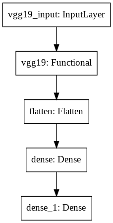

# Face Mask Detection
An application of Convolution Neural Networks to classify if a person is wearing a face mask or not (binary classification). 

## Dataset
The dataset used has 2 classes each with images of people with and without a mask. The data has been divided into Train, Validation and Test Set and is loaded using ImageDataGenerator.

The dataset maybe accessed <a href = "https://drive.google.com/drive/folders/1MaU49YgSFBqGbMVImh6k6f__q-_mowck?usp=sharing">here</a>.

## Model Architecture

## Usage
- Cloning the Repository: 

        git clone https://github.com/theAdarshSrivastava/Face_Mask_Detection
        
- Entering the directory: 

        cd Face_Mask_Detection
        
- Setting up the Python Environment with dependencies:

        pip install -r requirements.txt
        
- Entering the test directory: 

        cd test

- Running the file:

        python3 test.py

## Demonstration

https://user-images.githubusercontent.com/66861243/117566631-59708100-b0d5-11eb-81e6-94680115bd8c.mp4
